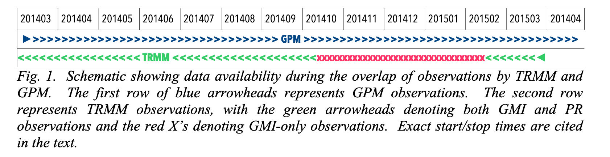
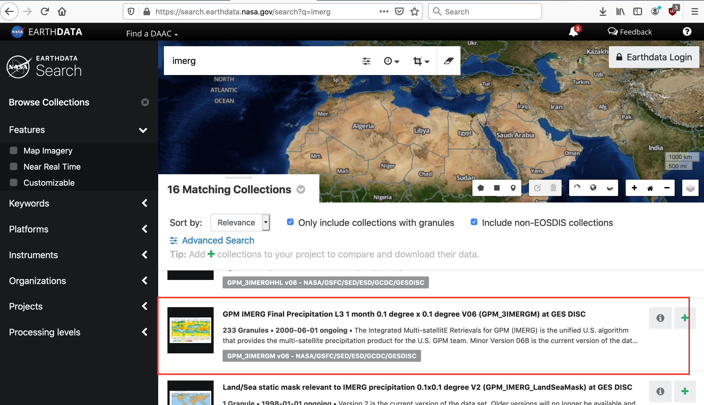
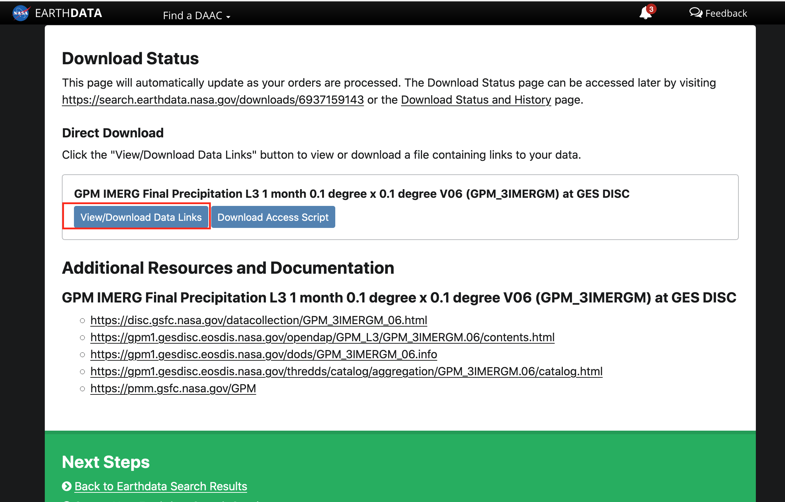
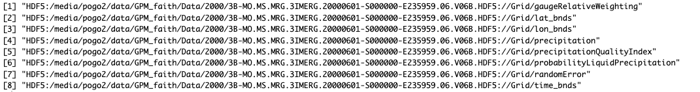
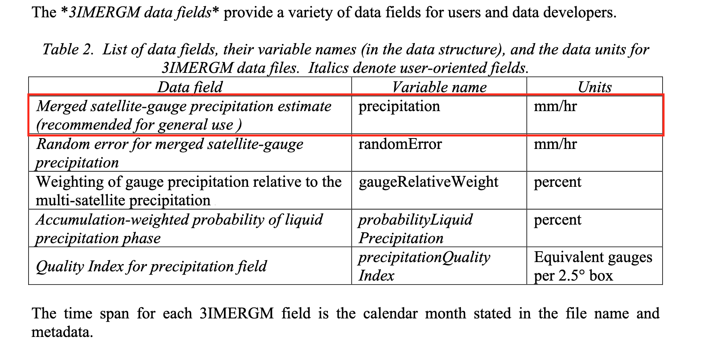

### Introduction

The official [technical report](https://pmm.nasa.gov/sites/default/files/document_files/IMERG_doc_190909.pdf) describes in details all aspects of GPM IMERG product.

It's worth noting that these images are both trmm and gpm layers together with an overlap. 


Trmm images have 25km resolution while Gpm have a 10km resolution.

```{r load required libraries,eval=FALSE}
library(raster)
library(gdalUtils)
library(tidyr)
```

### 1. Data download
GPM data download hit several barriers because they prohibited online ftp download . This meant functions in R like rcurl_download() nolonger works.

Therefore, to download this data.

1. Log into [Earthdata](https://urs.earthdata.nasa.gov/)

2. After sucessful log in, go to [Earthdata search](https://search.earthdata.nasa.gov/search) and search for **IMERG**

3. Select monthly product 


4. Then press "Download all button"(if you wish to download all the data, if not, choose what you want.)

5. After page redirects, choose "Direct Download" then "Done" then "Download data".

6. On the new page, select "View/Download data links"


7. Select "Download Links File" and save your text file and save as"mylinks.txt"

8. On you local machine/server terminal, go to the location you want to write the GPM images.

9. Run the following command 
**"wget --content-disposition --load-cookies ~/.urs_cookies --save-cookies ~/.urs_cookies --keep-session-cookies --content-disposition -i [mylinks.txt]"**

### 2. Conversion of HDF files to tif
From gdalinfo() 

and to get precipitation amounts we used subdataset 4

```{r,eval=FALSE}

setwd("GPM_faith")## set the working directory ( where the HDF files are)

files <- list.files(pattern="*.HDF",full.names = FALSE,recursive = TRUE)## list all HDF files in that directory

## convert .HDF files to .tif (i.e the 4th subdataset which is precipitation as per documentation)
for (filename in files){
  sds <- get_subdatasets(filename)
  gdal_translate(sds[4], dst_dataset=paste0(substr(filename, 1, nchar(filename)-5) ,".tif"))
}
```

### 3. Create a raster brick from all the monthly layers
```{r,eval=FALSE}
## stack all months together
setwd("GPM_faith")
gpm<-list.files(pattern ="*.tif" ,recursive = TRUE,full.names = TRUE)
gpmBrick<-brick(lapply(gpm,raster))
names(gpmBrick)<-paste0("gpm_",1:nlayers(gpmBrick))

writeRaster(gpmBrick,"gpmbrick.tif",format="GTiff", overwrite=TRUE)
```

### 4. Georefrence the raster stack(in QGIS)
This GPM stack is not georefrenced and i didn't find a way to do it in R so i used QGIS to reorefrence it. From the gdalinfo() document, following are the bounding coordinates to be used in georefrencing:
      - NorthBoundingCoordinate=90
      - SouthBoundingCoordinate=-90
      - EastBoundingCoordinate=180
      - WestBoundingCoordinate=-180  

### 5. Convert all -9999 or -9999.9 (missing data) to 0

As per the [documentation](https://pmm.nasa.gov/sites/default/files/document_files/IMERG_doc_190909.pdf) on page 64: 

**"All products in IMERG use the *standard missing value* "-9999.9"or ???-9999??? for 4-byte floats or 2-byte integers, respectively.Thesevalues are carried in the metadata."**

```{r,eval=FALSE}
brick<-brick("gpmbrick_modified.tif")## read in georefrenced brick ( the georefrencing was done in QGIS)
brick.new<- calc(brick, fun=function(x) { x[x<0] <- 0; return(x)})## replace all values less than zero with zero 
```

### 6. Convert the precipitation to mm from mm/hr for all monthly layers

According to [documentation](https://pmm.nasa.gov/sites/default/files/document_files/IMERG_doc_190909.pdf) the precipitation layer is in mm/hr.


This being a monthly product to convert mm/hr to mm, we muliply number of days in that month*24hrs.

**It should be noted that this product has data from June 2000 to October 2019**
```{r,eval=FALSE}
## function to retrive number of days in each month
numDays <- function(month,year){
  as.numeric(strftime(as.Date(paste(year+month%/%12,month%%12+1,"01",sep="-"))-1,"%d"))
}

monthdays<-sapply(1:12,numDays,2000:2019)%>%## list all month days from 2000 to 2019
  data.frame()%>%
  mutate(Year=2000:2019)## add year column
names(monthdays)[1:12]<-month.name## rename columns


monthdays<-monthdays%>%pivot_longer(January:December,names_to = "month",values_to = "days")## reshape
monthdays<-monthdays[-c(1:5,239:240),]## remove missing layers months
monthdays.time<-monthdays%>%mutate(hours=days*24)## multiply each number of days by 24 hours.

##  multiply each monthly layer by corresponding days*24hrs because the rainfall is in mm/hr as per the GPM documentation
for(i in 1:nrow(monthdays.time)) {
  brick.new[[i]]  <- brick.new[[i]] * monthdays.time$hours[i]
}

writeRaster(brick.new,"gpmbrick_final.tif",format="GTiff")## write out the final global monthly stack
```